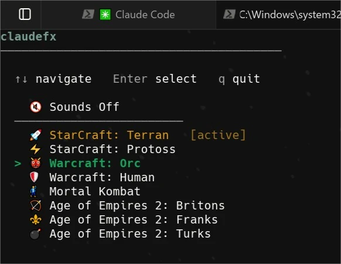

# claudefx 🎮

[](https://www.npmjs.com/package/claudefx)
[](https://opensource.org/licenses/MIT)

Retro game sounds and themed spinner verbs for [Claude Code](https://claude.ai/code). Plays nostalgic sound effects from **StarCraft**, **Warcraft**, **Mortal Kombat**, and **Age of Empires 2** when Claude finishes a response, starts a session, sends a notification, and more. Also replaces Claude's thinking spinner with game-themed phrases.

Works on **macOS**, **Windows**, and **Linux**.


## Installation

```bash
npx claudefx
```

That's it. Pick a theme from the menu — hooks are set up automatically using `npx`, no global install needed.

## Available Themes

| Theme | Game |
|-------|------|
| `sc-terran` | 🚀 StarCraft: Terran |
| `sc-protoss` | ⚡ StarCraft: Protoss |
| `wc-orc` | 👹 Warcraft: Orc |
| `wc-human` | 🛡️ Warcraft: Human |
| `mk` | 🕺 Mortal Kombat |
| `ao2-britons` | 🏹 Age of Empires 2: Britons |
| `ao2-franks` | ⚜️ Age of Empires 2: Franks |
| `ao2-turks` | 💣 Age of Empires 2: Turks |


## Themed Spinner Verbs

Each theme also replaces Claude Code's spinner verbs with game-themed phrases. While Claude is thinking, you'll see lines like *"Spawning zerglings"* or *"Summoning ogres"* instead of the defaults.


## Usage

### Interactive menu

```bash
npx claudefx
```

Use `↑↓` to navigate, `←→` to adjust volume, `Enter` to select, `q` to quit.



### CLI commands

```bash
npx claudefx list              # list all themes
npx claudefx use <theme>       # apply a theme
npx claudefx use ao2-turks     # example
npx claudefx off               # disable sounds
npx claudefx current           # show active theme
npx claudefx uninstall         # remove hooks, verbs, and uninstall package
npx claudefx volume <0-100>    # set volume (e.g. claudefx volume 60)
```

## How It Works

`claudefx use <theme>` writes hooks and spinner verbs to `~/.claude/settings.json`. Claude Code triggers sounds on these events:

| Event | When |
|-------|------|
| `sessionstart` | A session begins |
| `stop` | Claude finishes a response |
| `question` | Claude sends a notification |
| `sessionend` | A session ends |
| `submit` | You send a message |

## Requirements

- Node.js 18+
- Claude Code
- **macOS**: built-in `afplay` (no extra deps)
- **Windows**: built-in PowerShell (no extra deps)
- **Linux**: `mpg123` (`sudo apt install mpg123`)

## Uninstall

```bash
npx claudefx uninstall
```

Removes all hooks and spinner verbs from `~/.claude/settings.json`, uninstalls the package, and deletes all sound files.

## License

MIT © [Samet Acar](https://github.com/sametacar)

## Disclaimer

This is an unofficial fan project, free for personal and non-commercial use. It is not affiliated with, endorsed by, or sponsored by Blizzard Entertainment, Midway Games, Microsoft, or any other game publisher or rights holder. All sound clips remain the property of their respective owners. All trademarks and registered trademarks are the property of their respective owners.

If you are a rights holder and would like any content removed, please [open an issue](https://github.com/sametacar/claudefx/issues) and it will be taken down promptly.
